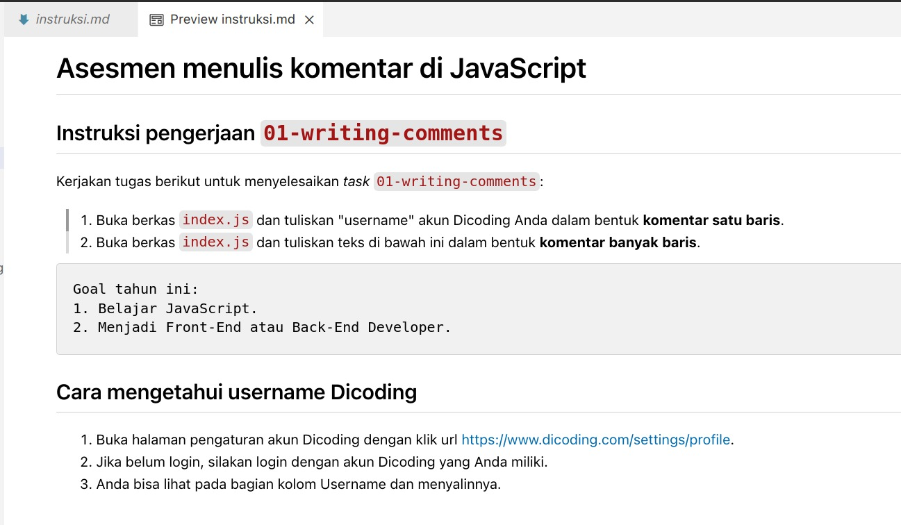

# Submission - Belajar Dasar Pemrograman JavaScript

Selamat datang di repositori submission untuk kursus "Belajar Dasar Pemrograman JavaScript". Dalam submission ini, terdapat berbagai tugas coding yang dirancang untuk membantu pemahaman dasar-dasar pemrograman menggunakan JavaScript.

## Tugas

Terdapat total 7 tugas coding yang harus dikerjakan:

- **Tugas Opsional (4 Tugas)**
  - Tugas 1: Writing Comments
  - Tugas 2: Code Style
  - Tugas 3: Writing Test
  - Tugas 4: OOP

- **Tugas Wajib (3 Tugas)**
  - Tugas 5: Recursive
  - Tugas 6: Full Coverage Testing
  - Tugas 7: Real World Scenario

## Cara Mengunduh Proyek

Proyek ini dapat diunduh untuk mendapatkan semua tugas coding yang diperlukan. Pengguna dapat mengunduhnya dengan mengklik tombol "Code" di bagian kanan atas repositori ini dan memilih "Download ZIP".

## Instruksi Tugas

Di dalam setiap folder tugas, terdapat berkas `instruksi.md`. Berkas ini berisi informasi penting mengenai tugas yang harus dikerjakan pada folder tersebut. Membaca instruksi dengan seksama sangat dianjurkan untuk memastikan pemahaman yang baik tentang setiap tugas.

## Tips Membaca Instruksi Tugas

Berkas `instruksi.md` ditulis dengan format markdown. Agar nyaman dalam membaca tugas yang diberikan, disarankan untuk memanfaatkan markdown viewer. Jika menggunakan VSCode, pengguna dapat mengaktifkan viewer tersebut dengan menekan tombol "Open Preview to the Side" (CTRL+Shift+V) sambil membuka berkas markdown tersebut.

Berikut adalah tampilan markdown viewer di VSCode:

Selamat belajar dan semoga sukses!